<!-- ══════════════════════════════════════════════════════════════════════
     Dinov2-ISIC — Skin Lesion Classifier
     A DINOv2-B backbone (86M params) fine-tuned on ISIC 2019 (8 classes).
     Training (Colab) · FastAPI backend · React + TS frontend.
     ══════════════════════════════════════════════════════════════════════ -->

<!-- Badges — Core -->
<p align="center">

  <!-- Core -->
  <a href="LICENSE">
    
  </a>
  <a href="https://github.com/H0NEYP0T-466/Dinov2-ISIC/stargazers">
    
  </a>
  <a href="https://github.com/H0NEYP0T-466/Dinov2-ISIC/network/members">
    
  </a>
  <a href="https://github.com/H0NEYP0T-466/Dinov2-ISIC/issues">
    
  </a>
  <a href="https://github.com/H0NEYP0T-466/Dinov2-ISIC/pulls">
    
  </a>
  <a href="CONTRIBUTING.md">
    
  </a>

  <!-- Activity -->
  <a href="https://github.com/H0NEYP0T-466/Dinov2-ISIC/commits/master">
    
  </a>
  
  
  

  <!-- Languages -->
  
  

  <!-- Security -->
  <a href="https://github.com/advisories/ghsa-Dinov2-ISIC">
    
  </a>

  <!-- Community -->
  <a href="https://github.com/H0NEYP0T-466/Dinov2-ISIC/discussions">
    
  </a>
  
  

</p>

---

## 📄 Short Description

**Dinov2-ISIC** is an end-to-end **skin-lesion classification** system that fine-tunes a **DINOv2-B** vision transformer backbone (~86M parameters) on the **ISIC 2019** benchmark for **8-class** single-label classification of dermoscopic images. It ships as three integrated pieces:

1. **Training script** — a self-contained Google Colab / Kaggle notebook with phased fine-tuning, imbalance handling (Focal Loss + Mixup/CutMix + class-aware augmentation), checkpointing, and rich visualisation.
2. **FastAPI backend** — an inference server (`/predict`, `/health`, `/classes`) with comprehensive logging and Docker support.
3. **React + TypeScript frontend** — upload a dermoscopic image and get the predicted lesion class with a full confidence breakdown.

> 🎯 **Result highlight:** best model (epoch 36) reaches **73.18 % accuracy / 71.37 % F1-macro** on the validation split, and **56.57 % accuracy / 50.19 % F1-macro** on the official ISIC 2019 **test set** (8,238 images).

---

## 🔗 Links

| Resource | Link |
|----------|------|
| 📖 Docs & Setup | This README below |
| 🐛 Report a Bug | [Issues](../../issues/new?template=bug_report.yml) |
| ✨ Request a Feature | [Issues](../../issues/new?template=feature_request.yml) |
| 🤝 Contribute | [CONTRIBUTING.md](CONTRIBUTING.md) |
| 🛡 Security | [SECURITY.md](SECURITY.md) |
| 📜 License | [LICENSE](LICENSE) |

---

## 📑 Table of Contents

- [ISIC 2019 Classes](#-isic-2019-classes)
- [Installation](#-installation)
- [⚡ Usage](#-usage)
- [✨ Features](#-features)
- [📊 Training](#-training)
- [📈 Training Curves \& Predictions](#-training-curves--predictions)
- [🧪 Test-Set Evaluation](#-test-set-evaluation)
- [🏗 Model Architecture](#-model-architecture)
- [📂 Folder Structure](#-folder-structure)
- [🛠 Tech Stack](#-tech-stack)
- [📦 Dependencies \& Packages](#-dependencies--packages)
- [🤝 Contributing](#-contributing)
- [📜 License](#-license)
- [🛡 Security](#-security)
- [📏 Code of Conduct](#-code-of-conduct)

---

## 🩺 ISIC 2019 Classes

Single-label **8-class** classification. RGB dermoscopic images. Class order matches the one-hot column order in `ISIC_2019_Training_GroundTruth.csv` and the model's logit output indices.

| Code | Full Name | Description |
|------|-----------|-------------|
| MEL  | Melanoma | Malignant tumour from melanocytes |
| NV   | Melanocytic nevus | Benign mole |
| BCC  | Basal cell carcinoma | Common skin cancer |
| AK   | Actinic keratosis | Pre-cancerous rough patch |
| BKL  | Benign keratosis | Seborrheic keratosis / solar lentigo |
| DF   | Dermatofibroma | Benign fibrous nodule |
| VASC | Vascular lesion | Blood-vessel related |
| SCC  | Squamous cell carcinoma | Skin cancer (keratinocyte-derived) |

> The 8-class nomenclature is the **single source of truth** and is duplicated in three places that must stay in sync: `backend/app/config.py` (`ISIC_CLASSES`), `kaggle/trainCollab.py` (`ISIC_CLASSES`), and `src/types/index.ts` (`CLASS_NAMES`).

---

## 🚀 Installation

### Prerequisites

- **Python** ≥ 3.10 and `pip`
- **Node.js** ≥ 18 and `npm` (for the frontend)
- A trained checkpoint `model_best.pth` placed at `backend/checkpoints/` (produced by the training step)
- (Optional) NVIDIA GPU + CUDA for fast inference; the backend runs on CPU too.

### 1. Clone

```bash
git clone https://github.com/H0NEYP0T-466/Dinov2-ISIC.git
cd Dinov2-ISIC
```

### 2. Backend

```bash
cd backend
python -m venv .venv
source .venv/bin/activate                 # Windows: .venv\Scripts\activate
pip install -r requirements.txt

# Place the trained checkpoint:
#   backend/checkpoints/model_best.pth
```

### 3. Frontend

```bash
# from repo root
npm install
```

### 4. Environment (frontend)

```bash
cp .env.example .env        # adjust VITE_API_BASE if the backend runs elsewhere
```

---

## ⚡ Usage

### Run the backend

```bash
cd backend
python -m app.main
# or:
uvicorn app.main:app --host 0.0.0.0 --port 8000 --reload
```

- API base: **http://localhost:8000**
- Swagger UI / interactive docs: **http://localhost:8000/docs**

### Run the frontend

```bash
npm run dev          # http://localhost:5173
```

The Vite dev server proxies `/api` → `http://localhost:8000` (see `vite.config.ts`).

### Call the API directly (CLI)

```bash
curl -X POST http://localhost:8000/api/v1/predict -F "file=@test.jpg"
```

Example JSON response:

```json
{
  "request_id": "abc123",
  "predicted_class": "NV",
  "predicted_label": "Melanocytic nevus",
  "confidence": 0.9312,
  "probabilities": { "MEL": 0.012, "NV": 0.9312, "BCC": 0.031, "AK": 0.004, "BKL": 0.011, "DF": 0.002, "VASC": 0.003, "SCC": 0.0058 },
  "inference_ms": 24.5,
  "threshold": 0.5
}
```

### End-to-end test

1. Start the backend (with `model_best.pth` in place).
2. Start the frontend (`npm run dev`).
3. Open http://localhost:5173, upload a dermoscopic image, click **Classify**.
4. Verify the predicted lesion class renders with confidence bars and all 8 class probabilities.
5. Watch the backend terminal — every preprocessing and inference step is logged.

### Docker (backend)

```bash
docker build -t dinov2-isic-backend ./backend
# CPU-only:
docker run -p 8000:8000 -v $(pwd)/backend/checkpoints:/app/checkpoints dinov2-isic-backend
# With GPU:
docker run --gpus all -p 8000:8000 -v $(pwd)/backend/checkpoints:/app/checkpoints dinov2-isic-backend
```

---

## ✨ Features

- **DINOv2-B backbone** — state-of-the-art self-supervised ViT, ~86M params, strong representation quality with a lightweight classification head.
- **Imbalance-aware training** — Focal Loss (γ=2.0), Label Smoothing (ε=0.1), Mixup (α=0.4) + CutMix (α=1.0), class-aware augmentation tiers, `WeightedRandomSampler` (inverse class frequency), Effective-Number class weights (β=0.9999).
- **3-phase fine-tuning** — head only → last 4 transformer blocks → full unfreeze, with per-phase adaptive batching to keep an effective batch of 32 under AMP.
- **Rich training observability** — per-epoch checkpointing, best-model selection on F1-macro, early stopping (patience 10), Cosine Annealing + warmup, TensorBoard logs, sample predictions and training curves every 5 epochs.
- **FastAPI inference** — `/predict`, `/health`, `/classes`; request IDs, `python-multipart` upload, CORS, Swagger UI.
- **Comprehensive logging** — every operation (startup, model load, each request, preprocessing, inference, errors) logged to both console (INFO) and a timestamped file (DEBUG) under `backend/logs/`.
- **React + TS frontend** — drag-and-drop upload, image preview, predicted class with confidence, expandable all-class probabilities, dark responsive UI.
- **Test-Time Augmentation (TTA)** — optional multi-view averaging for a robust inference boost.
- **Reproducible** — env-var config, Docker support, deterministic single source of truth for the class list.

---

## 📊 Training

A single self-contained script — `kaggle/trainCollab.py` — designed to run on **Google Colab** or **Kaggle** (2× T4 / P100 GPUs).

### Dataset setup (Google Colab)

```python
from google.colab import drive
drive.mount('/content/drive')
```

Place the ISIC 2019 dataset on your Drive:

```
/content/drive/MyDrive/dataset/
├── ISIC_2019_Training_GroundTruth.csv
└── ISIC_2019_Training_Input/
    ├── ISIC_0000000.jpg
    ├── ISIC_0000001.jpg
    └── ...
```

### Run

```bash
pip install timm scikit-learn matplotlib pandas pillow tensorboard
python trainCollab.py
```

### Training configuration (from the best run — `backend/logs/training (2).log`)

| Setting | Value |
|---------|-------|
| Python | 3.12.13 |
| PyTorch | 2.10.0+cu128 |
| GPUs | 2 × Tesla T4 |
| Classes | 8 (AK, BCC, BKL, DF, MEL, NV, SCC, VASC) |
| Images | 25,331 total → Train 20,264 / Val 5,067 |
| Focal Loss | γ = 2.0, label smoothing ε = 0.1 |
| Mixup / CutMix | α = 0.4 / α = 1.0 |
| Class weights | Effective Number β = 0.9999 (DF/VASC highest) |
| LR schedule | Cosine Annealing + 2-epoch warmup |
| Early stopping | patience 10, on **F1-macro** |
| AMP | ✅ enabled |
| Effective batch | 32 (per-phase adaptive) |
| Phase 1 — head | 5 epochs, lr 3e-4, batch 32 × accum 1 |
| Phase 2 — last 4 blocks | 15 epochs, lr 5e-5, batch 16 × accum 2 |
| Phase 3 — full | 20 epochs, lr 1e-5, batch 16 × accum 2 |

### Class distribution

| Class | Train images | Share | Tier |
|-------|-------------|-------|------|
| NV    | 10,300 | 50.8 % | majority |
| MEL   | 3,618 | 17.9 % | majority |
| BCC   | 2,658 | 13.1 % | mid |
| BKL   | 2,099 | 10.4 % | mid |
| AK    | 694 | 3.4 % | minority |
| SCC   | 502 | 2.5 % | minority |
| VASC  | 202 | 1.0 % | extreme |
| DF    | 191 | 0.9 % | extreme |

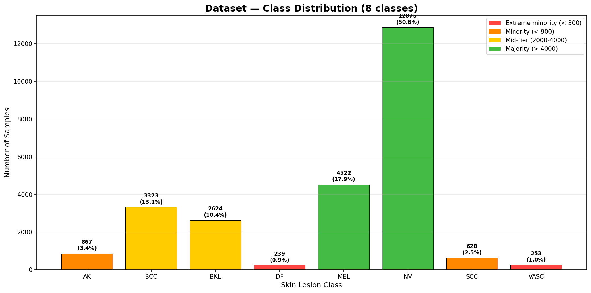

*Best model selected at **epoch 36** with **val F1-macro = 0.7139**, val accuracy = **73.22 %**, val balanced accuracy = **72.19 %**.*

### Training log snapshot (val metrics, best run)

```
Epoch 29  Val Loss 0.1811  Acc 0.7184  BalAcc 0.7003  F1-macro 0.6938 ★ new best
Epoch 30  Val Loss 0.1683  Acc 0.7095  BalAcc 0.7304  F1-macro 0.6834
Epoch 36  Val Loss 0.1777  Acc 0.7322  BalAcc 0.7219  F1-macro 0.7139 ★ new best  ← chosen
Epoch 38  Val Loss 0.1968  Acc 0.7377  BalAcc 0.6641  F1-macro 0.6943
Epoch 40  Val Loss 0.2012  Acc 0.7353  BalAcc 0.6562  F1-macro 0.6825
```

The best run (Te T4, 2 GPUs) shows minority-class recall steadily improving through the full-finetune phase:

| Epoch | AK | DF | SCC | VASC |
|-------|------|------|------|------|
| 1 (head) | 0.2370 | 0.5208 | 0.7222 | 0.8235 |
| 40 (full) | 0.4393 | 0.7083 | 0.5159 | 0.6471 |

Outputs land in `Dinov2-IRIC-output/` on Drive (or locally under the configured output dir). **Copy `model_best.pth` → `backend/checkpoints/`.**

---

## 📈 Training Curves & Predictions

Training curves (2×2 grid: train/val loss + accuracy) and sample prediction grids (4×4 with true/pred labels) are logged every 5 epochs.

### Loss & accuracy curves (epoch 5 → 40)

| Epoch 5 | Epoch 10 | Epoch 15 | Epoch 20 |
|---------|----------|----------|----------|
| 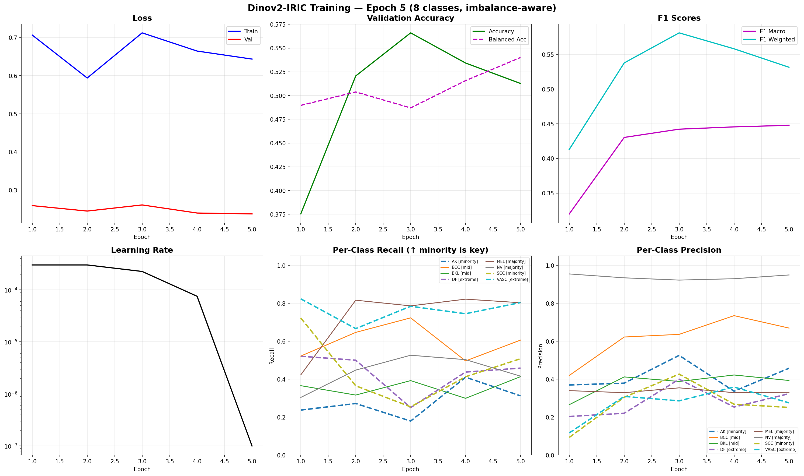 | 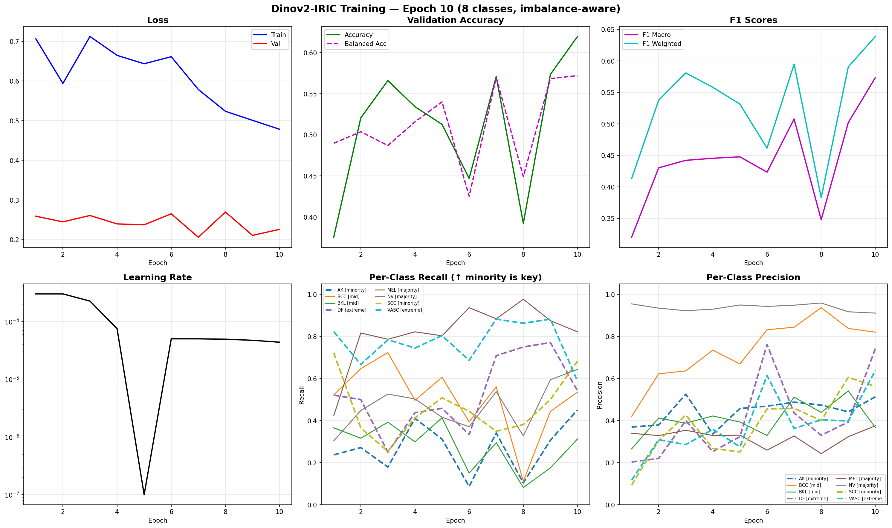 | 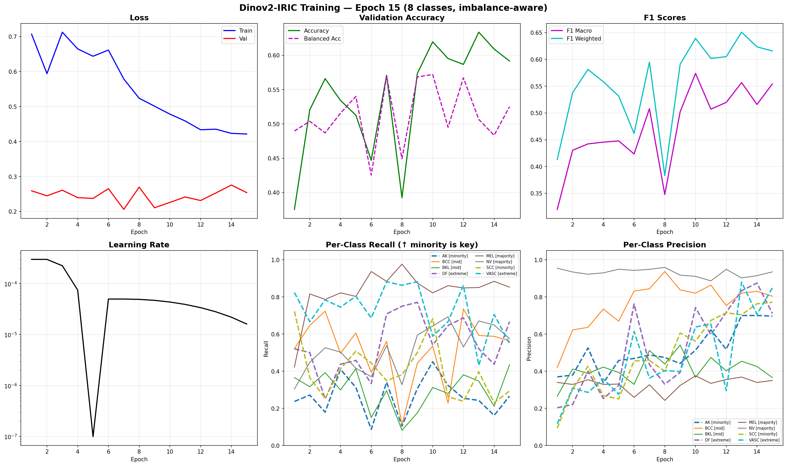 | 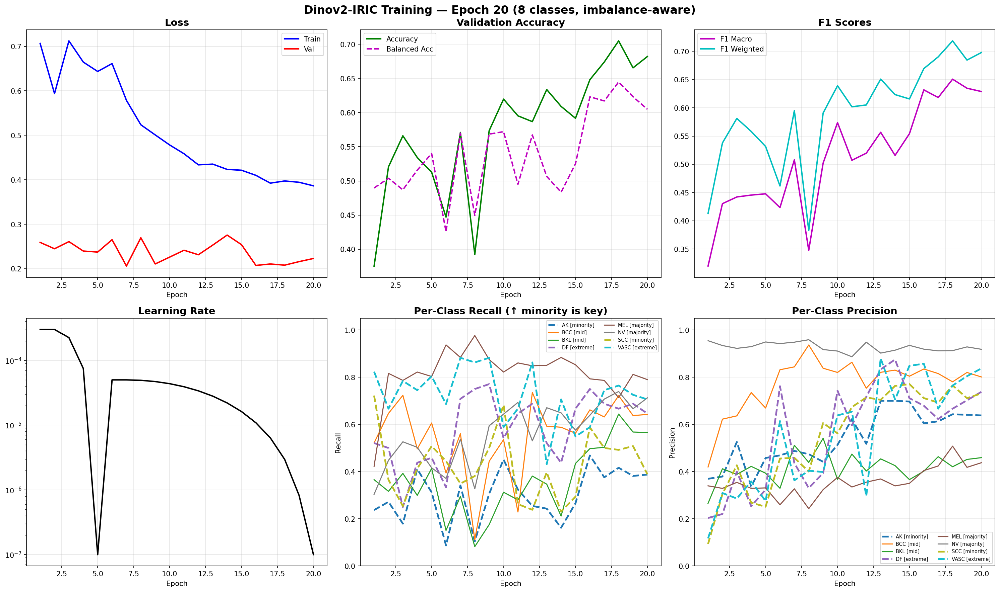 |

| Epoch 25 | Epoch 30 | Epoch 35 | Epoch 40 |
|----------|----------|----------|----------|
| 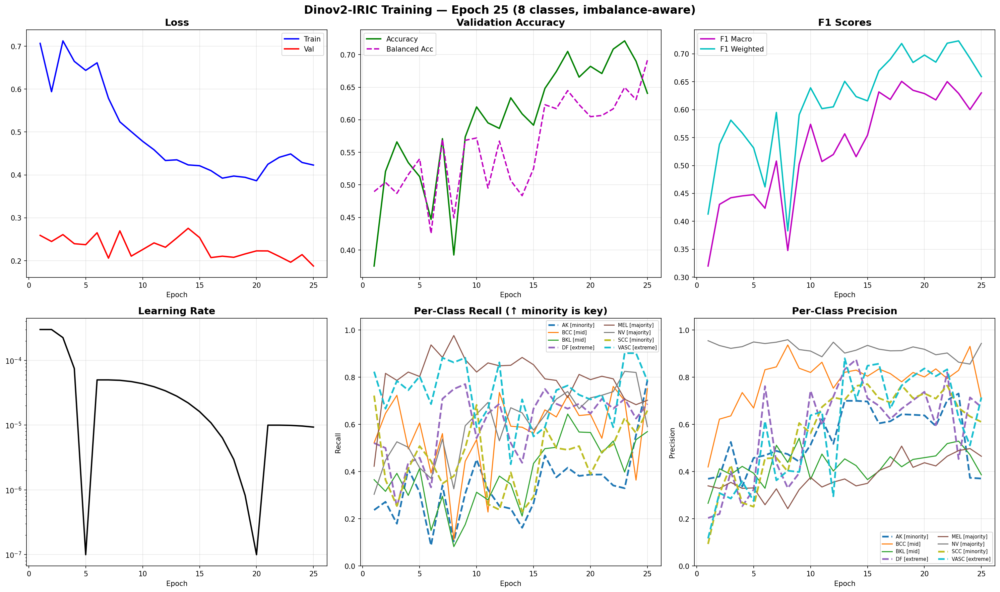 | 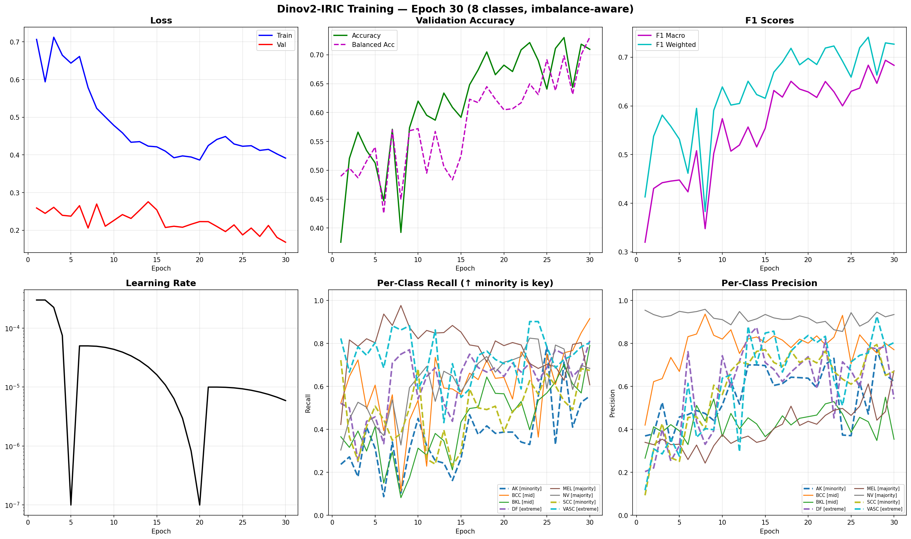 | 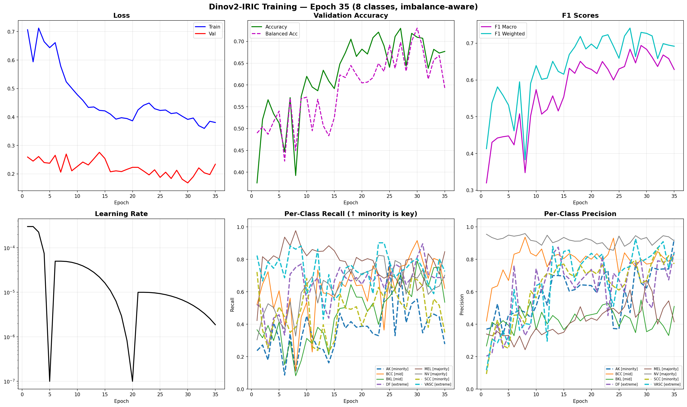 | 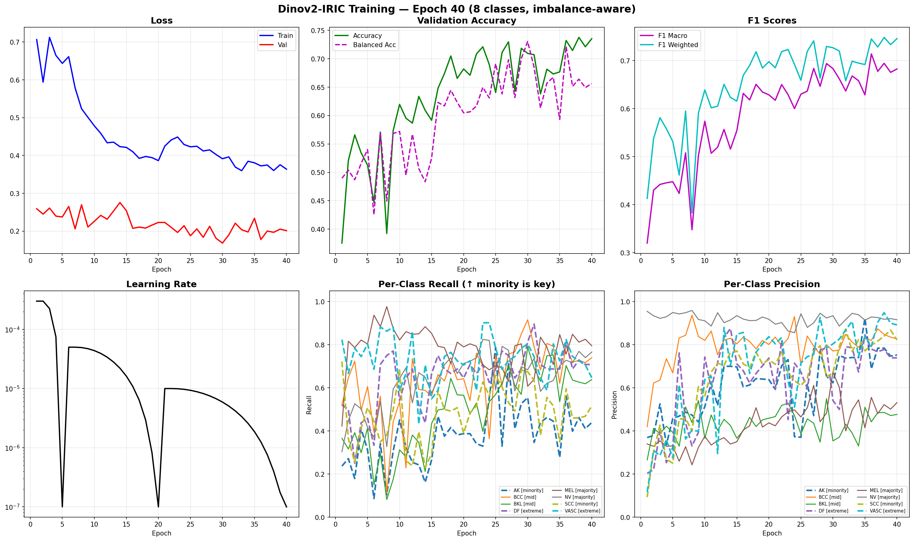 |

### Sample predictions (4×4 grid with true/pred labels)

| Epoch 5 | Epoch 10 | Epoch 15 | Epoch 20 |
|---------|----------|----------|----------|
|  |  |  |  |

| Epoch 25 | Epoch 30 | Epoch 35 | Epoch 40 |
|----------|----------|----------|----------|
|  |  | 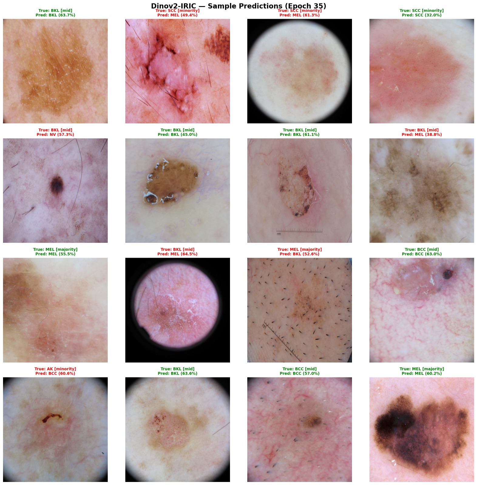 |  |

> Epoch 36 model predictions show clean separation for the majority classes (NV, BCC) and improving recognition of rare lesions (DF, VASC).

---

## 🧪 Test-Set Evaluation

The model was evaluated on the **official ISIC 2019 test set** (8,238 images) via `kaggle/test_kaggle.py`. The confusion matrices and metrics below are saved under [`visuals/test_results/`](./visuals/test_results/).

### Test-set confusion matrix

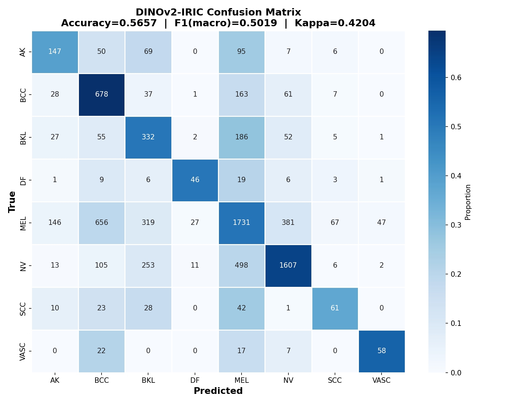

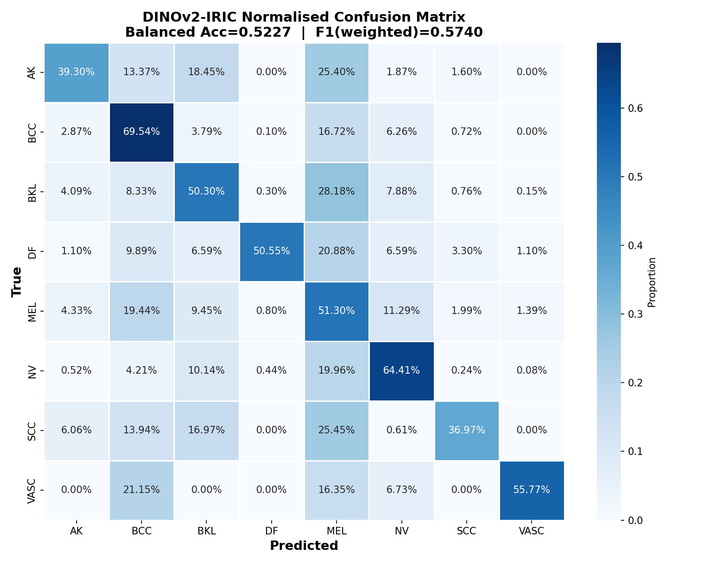

### Overall test metrics

| Metric | Value |
|--------|-------|
| **Accuracy** | **0.5657** |
| **Balanced Accuracy** | **0.5227** |
| Cohen's Kappa | 0.4204 |
| MCC | 0.4251 |
| Precision (macro) | 0.4973 |
| Recall (macro) | 0.5227 |
| **F1 (macro)** | **0.5019** |
| F1 (weighted) | 0.5740 |

> Full metrics: [`visuals/test_results/metrics.csv`](./visuals/test_results/metrics.csv)

### Per-class test report


| Class | Precision | Recall | F1 | Support |
|-------|-----------|--------|-----|---------|
| AK  | 0.3952 | 0.3930 | 0.3941 | 374 |
| BCC | 0.4243 | 0.6954 | 0.5270 | 975 |
| BKL | 0.3180 | 0.5030 | 0.3897 | 660 |
| DF  | 0.5287 | 0.5055 | 0.5169 | 91 |
| MEL | 0.6292 | 0.5130 | 0.5652 | 3,374 |
| NV  | 0.7573 | 0.6441 | 0.6961 | 2,495 |
| SCC | 0.3935 | 0.3697 | 0.3813 | 165 |
| VASC| 0.5321 | 0.5577 | 0.5446 | 104 |
| **Macro avg** | **0.4973** | **0.5227** | **0.5019** | **8,238** |
| Weighted avg | 0.6011 | 0.5657 | 0.5740 | 8,238 |

### Validation-set report (best model, epoch 36)

For comparison, the best model's performance on the **validation split** (5,067 images):

| Class | Precision | Recall | F1 | Support |
|-------|-----------|--------|-----|---------|
| AK  | 0.6879 | 0.5607 | 0.6178 | 173 |
| BCC | 0.8202 | 0.7955 | 0.8076 | 665 |
| BKL | 0.4419 | 0.7029 | 0.5426 | 525 |
| DF  | 0.7800 | 0.8125 | 0.7959 | 48 |
| MEL | 0.5552 | 0.7566 | 0.6404 | 904 |
| NV  | 0.9286 | 0.7274 | 0.8158 | 2,575 |
| SCC | 0.7979 | 0.5952 | 0.6818 | 126 |
| VASC| 0.7925 | 0.8235 | 0.8077 | 51 |
| **Accuracy** | | | **0.7318** | **5,067** |
| Macro avg | 0.7255 | 0.7218 | 0.7137 | 5,067 |
| Weighted avg | 0.7831 | 0.7318 | 0.7448 | 5,067 |

### Confusion matrix (validation, standard & TTA)

| Standard | Test-Time Augmentation (TTA) |
|----------|------------------------------|
| 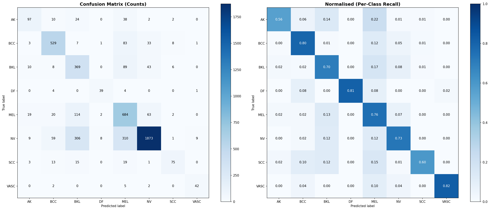 | 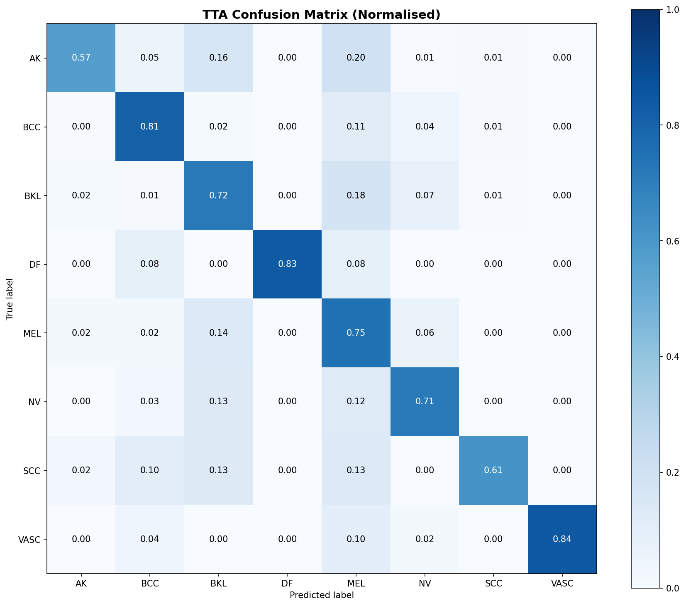 |

TTA (5 views per image) was also run at the end of training, nudging macro recall up from 0.7218 → **0.7311** (see `backend/logs/classification_report_tta.txt`).

> The gap between validation (~73 %) and official-test (~57 %) accuracy is expected: the official test set has a different distribution and was never used for model selection.

---

## 🏗 Model architecture

```
Input (1, 3, 224, 224)
   │
   ├── DINOv2-B backbone  (timm: vit_base_patch14_dinov2.lvd142m, 768-d, ~86M params)
   │       └── num_classes=0  → pooled 768-d feature
   │
   └── Head:
           Linear(768 → 512) → ReLU → Dropout(0.3) → Linear(512 → 8)
   │
   └── raw logits (1, 8)   # softmax applied at inference / CrossEntropyLoss at training
```

No softmax inside the model — probabilities come from `torch.softmax` at inference, and `CrossEntropyLoss` applies it internally during training. Identical architecture across training, backend loader, and checkpoint format.

### Configuration overrides

Backend settings can be overridden via environment variables (see `backend/app/config.py`):

| Var | Default | Notes |
|-----|---------|-------|
| `MODEL_CHECKPOINT` | `backend/checkpoints/model_best.pth` | Path to trained weights |
| `DEVICE` | `auto` (cuda if available, else cpu) | Force a device |
| `INFERENCE_THRESHOLD` | `0.5` | Min confidence to report |
| `CORS_ORIGINS` | `["*"]` | Restrict in production |

---

## 📂 Folder structure

```
Dinov2-ISIC/
├── backend/
│   ├── app/
│   │   ├── main.py                 # FastAPI entry (lifespan, CORS, router)
│   │   ├── config.py               # Settings + shared ISIC_CLASSES list
│   │   ├── api/routes.py           # /predict, /health, /classes
│   │   ├── models/dinov2.py        # DINOv2Classifier + checkpoint loader
│   │   ├── services/predictor.py
│   │   ├── services/logger.py
│   │   └── utils/image_processing.py
│   ├── checkpoints/                # <- place model_best.pth here
│   ├── dataset/                    # ISIC 2019 dataset (gitignored)
│   ├── logs/                       # training + server logs
│   │   ├── training.log
│   │   ├── training (1).log
│   │   ├── training (2).log        # best run (epoch 36, F1-macro 0.7139)
│   │   ├── classification_report.txt
│   │   └── classification_report_tta.txt
│   ├── requirements.txt
│   └── Dockerfile
├── kaggle/
│   ├── trainCollab.py              # single-file Colab/Kaggle training script
│   ├── train.py                    # standalone training script
│   ├── test_kaggle.py              # official ISIC 2019 test-set evaluation
│   └── train_requirements.txt
├── visuals/                        # training visualisations (see section above)
│   ├── class_distribution.png
│   ├── confusion_matrix.png
│   ├── confusion_matrix_tta.png
│   ├── curves_epoch_*.png
│   ├── pred_E*.jpeg
│   └── test_results/               # official test-set metrics & matrices
│       ├── confusion_matrix.png
│       ├── confusion_matrix_normalised.png
│       ├── metrics.csv
│       └── per_class_report.csv
├── src/                            # React frontend
│   ├── App.tsx
│   ├── components/
│   │   ├── ConfidenceBar.tsx
│   │   ├── ImageUploader.tsx
│   │   └── PredictionResults.tsx
│   ├── services/api.ts
│   └── types/index.ts              # shared types + CLASS_NAMES
├── .github/
│   ├── ISSUE_TEMPLATE/
│   │   ├── config.yml
│   │   ├── bug_report.yml
│   │   └── feature_request.yml
│   └── pull_request_template.md
├── index.html
├── vite.config.ts
├── tsconfig*.json
├── package.json
├── package-lock.json
├── eslint.config.js
├── .env.example
├── .gitignore
├── LICENSE
├── CONTRIBUTING.md
├── SECURITY.md
├── CODE_OF_CONDUCT.md
└── README.md
```

---

## 🛠 Tech Stack

<details>
<summary><b>💻 Languages</b></summary>

<br>


</details>

<details>
<summary><b>🧠 Frameworks & Libraries</b></summary>

<br>


</details>

<details>
<summary><b>🧰 DevOps / CI / Tools</b></summary>

<br>


</details>

<details>
<summary><b>☁️ Compute / Cloud</b></summary>

<br>


</details>

---

## 📦 Dependencies & Packages

### Runtime Dependencies

#### 🔹 Backend (Python)

<details>
<summary><b>Backend runtime requirements</b> (from <code>backend/requirements.txt</code>)</summary>

<br>

[](https://pypi.org/project/fastapi/)
[](https://pypi.org/project/uvicorn/)
[](https://pypi.org/project/python-multipart/)
[](https://pypi.org/project/pydantic/)
[](https://pypi.org/project/pydantic-settings/)
[](https://pypi.org/project/torch/)
[](https://pypi.org/project/torchvision/)
[](https://pypi.org/project/timm/)
[](https://pypi.org/project/Pillow/)
[](https://pypi.org/project/numpy/)

<br>

| Package | Minimum version |
|---------|-----------------|
| fastapi | ≥ 0.110.0 |
| uvicorn[standard] | ≥ 0.27.0 |
| python-multipart | ≥ 0.0.9 |
| pydantic | ≥ 2.6.0 |
| pydantic-settings | ≥ 2.2.0 |
| torch | ≥ 2.1.0 |
| torchvision | ≥ 0.16.0 |
| timm | ≥ 1.0.0 |
| Pillow | ≥ 10.0.0 |
| numpy | ≥ 1.24.0 |

</details>

#### 🔹 Frontend (Node.js)

<details>
<summary><b>Frontend runtime dependencies</b> (from <code>package.json</code>)</summary>

<br>

[](https://www.npmjs.com/package/react)
[](https://www.npmjs.com/package/react-dom)

<br>

| Package | Version |
|---------|---------|
| react | ^19.2.6 |
| react-dom | ^19.2.6 |

</details>

#### 🔹 Training (Python, Kaggle / Colab)

<details>
<summary><b>Training dependencies</b> (from <code>kaggle/train_requirements.txt</code>)</summary>

<br>

[](https://pypi.org/project/timm/)
[](https://pypi.org/project/datasets/)
[](https://pypi.org/project/scikit-learn/)
[](https://pypi.org/project/matplotlib/)
[](https://pypi.org/project/tensorboard/)

<br>

| Package | Minimum version |
|---------|-----------------|
| timm | ≥ 1.0.0 |
| datasets | ≥ 2.14.0 |
| scikit-learn | ≥ 1.3.0 |
| matplotlib | ≥ 3.7.0 |
| tensorboard | ≥ 2.14.0 |

</details>

---

### Dev / Build / Test Dependencies

<details>
<summary><b>Frontend dev dependencies</b> (from <code>package.json</code> — required for build & typecheck)</summary>

<br>

| Package | Version |
|---------|---------|
| @eslint/js | ^10.0.1 |
| @types/node | ^24.12.3 |
| @types/react | ^19.2.14 |
| @types/react-dom | ^19.2.3 |
| @vitejs/plugin-react | ^6.0.1 |
| eslint | ^10.3.0 |
| eslint-plugin-react-hooks | ^7.1.1 |
| eslint-plugin-react-refresh | ^0.5.2 |
| globals | ^17.6.0 |
| typescript | ~6.0.2 |
| typescript-eslint | ^8.59.2 |
| vite | ^8.0.12 |

</details>

---

## 🤝 Contributing

We welcome contributions! Please read our [CONTRIBUTING.md](CONTRIBUTING.md) for details on forking, code style, commit conventions, and the pull request process. By participating you agree to follow our [Code of Conduct](CODE_OF_CONDUCT.md).

---

## 📜 License

This project is licensed under the **MIT License** — see the [LICENSE](LICENSE) file for details.

---

## 🛡 Security

Found a vulnerability? Please review our [Security Policy](SECURITY.md) and report issues responsibly. Do **not** use public issues for security-sensitive reports.

---

## 📏 Code of Conduct

All contributors and participants are expected to follow our [Code of Conduct](CODE_OF_CONDUCT.md) (Contributor Covenant v2.1) to keep our community respectful and inclusive.

---

<p align="center">Made with ❤ by <a href="https://github.com/H0NEYP0T-466">H0NEYP0T-466</a></p>
